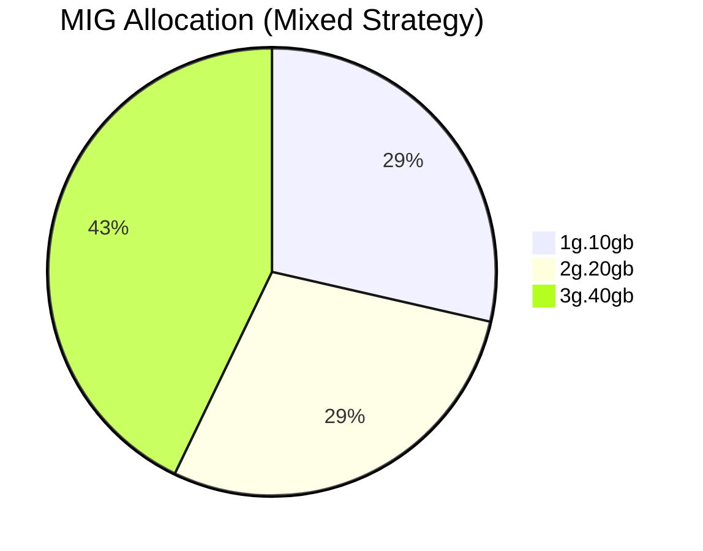

# Understanding NVIDIA GPU Sharing: MIG

This document summarizes the concepts of NVIDIA GPU **MIG (Multi-Instance GPU)**, along with strategies and configurations for optimal GPU utilization. It also includes diagrams and a clean structure to make it easy to understand.

---

## Table of Contents

1. [What is MIG (Multi-Instance GPU)?](#what-is-mig-multi-instance-gpu)
2. [Key Features of MIG](#key-features-of-mig)
3. [MIG Strategies](#mig-strategies)
4. [Diagrams](#diagrams)
5. [When to Use MIG](#when-to-use-mig)

---

## What is MIG (Multi-Instance GPU)?

**MIG** allows a single physical GPU to be divided into **hardware-isolated slices**, each functioning as an independent GPU instance.

### Key Features:
- **Partitioned Resources:** Compute and memory resources are divided into MIG instances.
- **Hardware Isolation:** Instances are fully isolated.
- **Concurrent Execution:** Multiple workloads run simultaneously.

### Use Case:
- Resource-intensive tasks like AI inference or distributed training.
- Multi-tenant environments with predictable performance requirements.

---

## Key Features of MIG

| **Aspect**                  | **Description**                          |
|-----------------------------|------------------------------------------|
| **Resource Sharing**        | Physically partitions the GPU.           |
| **Concurrency**             | Multiple workloads run concurrently.     |
| **Isolation**               | Strong hardware-level isolation.         |
| **Performance**             | Consistent and predictable performance.  |
| **Overhead**                | Minimal overhead.                        |
| **Use Case**                | Resource-intensive or multi-tenant tasks.|

---

## MIG Strategies

MIG offers multiple strategies to allocate GPU resources. Below are the key strategies:

### **1. Mixed Strategy**
Combines different MIG profiles on a single GPU for heterogeneous workloads.

- Example:
  - 1 x `3g.40gb` (3 slices for training tasks)
  - 2 x `2g.20gb` (4 slices for inference tasks)

### **2. All-Balanced Strategy**
Divides the GPU into identical MIG instances for homogeneous workloads.

- Example:
  - 7 x `1g.10gb` (Each instance uses 1 slice.)

### **3. High-Performance Strategy**
Reserves the entire GPU for one workload.

- Example:
  - 1 x `7g.80gb` (Uses all slices.)

### **4. Memory-Balanced Strategy**
Prioritizes even memory distribution across MIG instances.

- Example:
  - 2 x `3g.40gb`
  - 1 x `1g.10gb`

### **5. Compute-Balanced Strategy**
Focuses on equal distribution of GPU compute resources.

- Example:
  - 3 x `2g.20gb`

### **6. Custom Strategy**
Fully customized configuration tailored to workload requirements.

---

## Diagrams

### MIG Resource Sharing Example

---

## When to Use MIG

### Use **MIG** When:
- Workloads require strict isolation or predictable performance.
- You’re in a multi-tenant environment (e.g., Kubernetes or cloud setups).
- Tasks include AI inference or distributed training.

---

### Let us know if you'd like more examples, or diagrams or want to dive deeper into a specific strategy!
