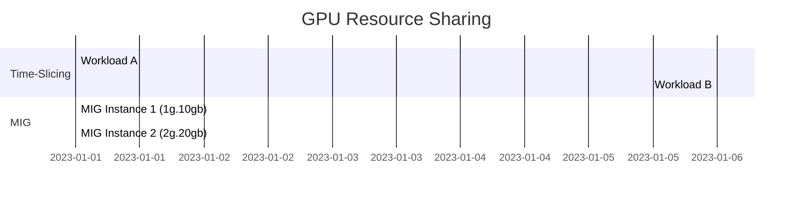
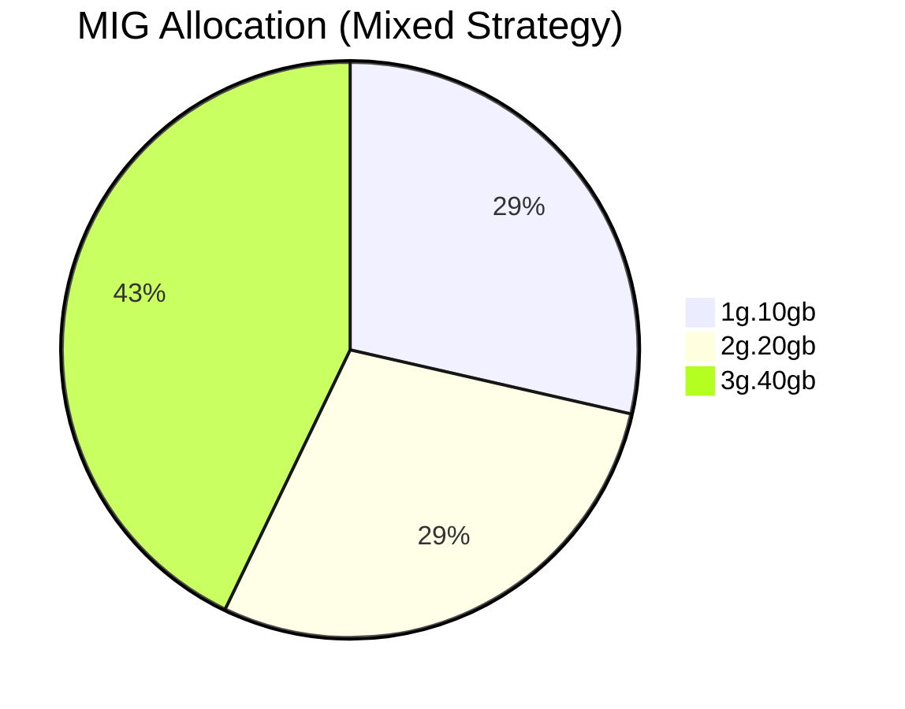
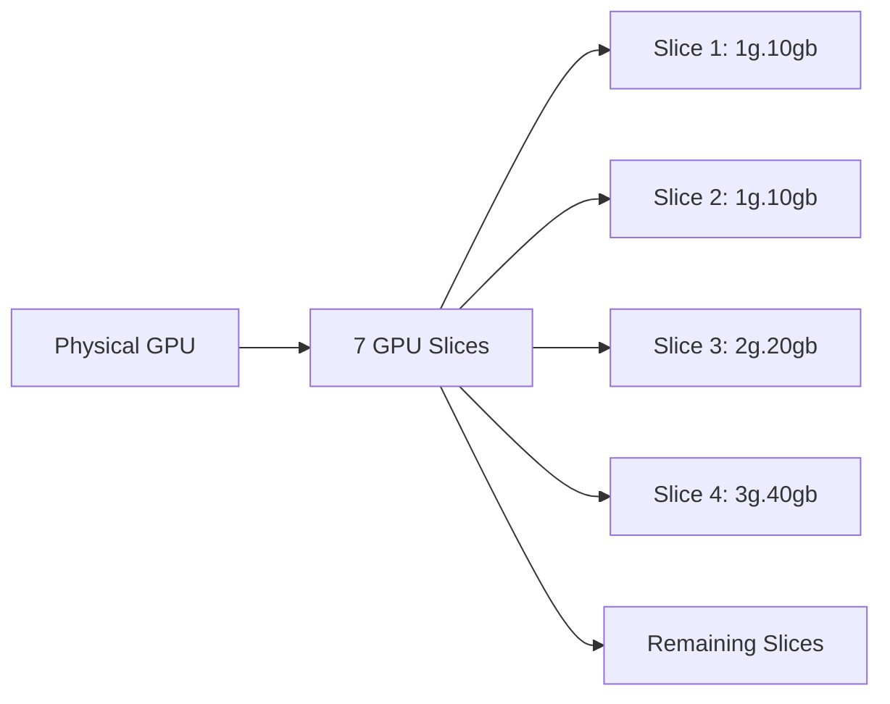

# Understanding NVIDIA GPU Sharing: Time-Slicing vs. MIG

This document summarizes the concepts of NVIDIA GPU **Time-Slicing** and **MIG (Multi-Instance GPU)**, along with strategies and configurations for optimal GPU utilization. It also includes diagrams and a clean structure to make it easy to understand.

---

## Table of Contents

1. [What is Time-Slicing?](#what-is-time-slicing)
2. [What is MIG (Multi-Instance GPU)?](#what-is-mig-multi-instance-gpu)
3. [Key Differences Between Time-Slicing and MIG](#key-differences-between-time-slicing-and-mig)
4. [MIG Strategies](#mig-strategies)
5. [Types of NVIDIA MIG Profiles](#types-of-nvidia-mig-profiles)
6. [Common MIG Profiles and Their Uses](#common-mig-profiles-and-their-uses)
7. [What Does 1/7th Mean for GPU?](#what-does-17th-mean-for-gpu)
8. [Diagrams](#diagrams)
9. [When to Use Time-Slicing vs. MIG](#when-to-use-time-slicing-vs-mig)

---

## What is Time-Slicing?

**Time-Slicing** is a GPU sharing mechanism where the GPU alternates access across multiple workloads in quick succession. Each workload gets a time slice to utilize the GPU.

### Key Features:
- **Shared Resources:** The full GPU is used by one workload at a time.
- **Dynamic Allocation:** Suitable for general-purpose workloads.
- **Context Switching Overhead:** Performance may degrade for latency-sensitive tasks.

### Use Case:
- General-purpose tasks like virtual desktops, gaming, or lightweight AI inference.

---

## What is MIG (Multi-Instance GPU)?

**MIG** allows a single physical GPU to be divided into **hardware-isolated slices**, each functioning as an independent GPU instance.

### Key Features:
- **Partitioned Resources:** Compute and memory resources are divided into MIG instances.
- **Hardware Isolation:** Instances are fully isolated.
- **Concurrent Execution:** Multiple workloads run simultaneously.

### Use Case:
- Resource-intensive tasks like AI inference or distributed training.
- Multi-tenant environments with predictable performance requirements.

---

## Key Differences Between Time-Slicing and MIG

| **Aspect**                  | **Time-Slicing**                         | **MIG**                                   |
|-----------------------------|------------------------------------------|------------------------------------------|
| **Resource Sharing**        | Alternates access over time.             | Physically partitions the GPU.           |
| **Concurrency**             | One workload at a time.                  | Multiple workloads run concurrently.     |
| **Isolation**               | No isolation between workloads.          | Strong hardware-level isolation.         |
| **Performance**             | Can degrade due to context switching.    | Consistent and predictable performance.  |
| **Overhead**                | Higher due to frequent switching.        | Minimal overhead.                        |
| **Use Case**                | General-purpose workloads.               | Resource-intensive or multi-tenant tasks.|

---

## MIG Strategies

MIG offers multiple strategies to allocate GPU resources. Below are the key strategies:

### **1. Mixed Strategy**
Combines different MIG profiles on a single GPU for heterogeneous workloads.

- Example:
  - 1 x `3g.40gb` (3 slices for training tasks)
  - 2 x `2g.20gb` (4 slices for inference tasks)

### **2. All-Balanced Strategy**
Divides the GPU into identical MIG instances for homogeneous workloads.

- Example:
  - 7 x `1g.10gb` (Each instance uses 1 slice.)

### **3. High-Performance Strategy**
Reserves the entire GPU for one workload.

- Example:
  - 1 x `7g.80gb` (Uses all slices.)

### **4. Memory-Balanced Strategy**
Prioritizes even memory distribution across MIG instances.

- Example:
  - 2 x `3g.40gb`
  - 1 x `1g.10gb`

### **5. Compute-Balanced Strategy**
Focuses on equal distribution of GPU compute resources.

- Example:
  - 3 x `2g.20gb`

### **6. Custom Strategy**
Fully customized configuration tailored to workload requirements.

---

## Types of NVIDIA MIG Profiles

MIG profiles define how GPU resources are divided. Each profile specifies the number of GPU slices and the memory allocated to each instance. Below are the main types:

- **1g.10gb**: 1 GPU slice with 10 GB memory.
- **2g.20gb**: 2 GPU slices with 20 GB memory.
- **3g.40gb**: 3 GPU slices with 40 GB memory.
- **4g.40gb**: 4 GPU slices with 40 GB memory.
- **7g.80gb**: All 7 GPU slices with 80 GB memory (entire GPU).

---

## Common MIG Profiles and Their Uses

| **MIG Profile** | **Slices Used** | **Memory Allocated** | **Use Case**                                    |
|------------------|-----------------|----------------------|------------------------------------------------|
| 1g.10gb         | 1               | 10 GB               | Lightweight inference tasks.                   |
| 2g.20gb         | 2               | 20 GB               | Moderate workloads like AI inference.         |
| 3g.40gb         | 3               | 40 GB               | Training or large-scale inference.            |
| 4g.40gb         | 4               | 40 GB               | Multi-tenant applications with shared memory. |
| 7g.80gb         | 7               | 80 GB               | High-performance computing or training.       |

---

## What Does 1/7th Mean for GPU?

The term **1/7th** refers to the fraction of the GPU's total compute and memory resources allocated to a single slice when using the MIG feature. NVIDIA GPUs that support MIG can be split into a maximum of 7 slices.

For example:
- A single slice (1g.10gb) uses 1/7th of the GPU’s resources.
- If you allocate 3 slices (3g.40gb), you are using 3/7th of the GPU’s resources.

This ensures efficient partitioning of resources for multiple applications.

---

## Diagrams

### Time-Slicing vs. MIG Resource Sharing

### Mixed Strategy Example

### GPU Slicing Diagram

---

## When to Use Time-Slicing vs. MIG

### Use **Time-Slicing** When:
- Workloads are lightweight and don’t require dedicated GPU resources.
- You need flexibility for dynamic allocation.
- Tasks include virtual desktops, gaming, or non-AI workloads.

### Use **MIG** When:
- Workloads require strict isolation or predictable performance.
- You’re in a multi-tenant environment (e.g., Kubernetes or cloud setups).
- Tasks include AI inference or distributed training.

---

### Let us know if you'd like more examples, or diagrams or want to dive deeper into a specific strategy!
